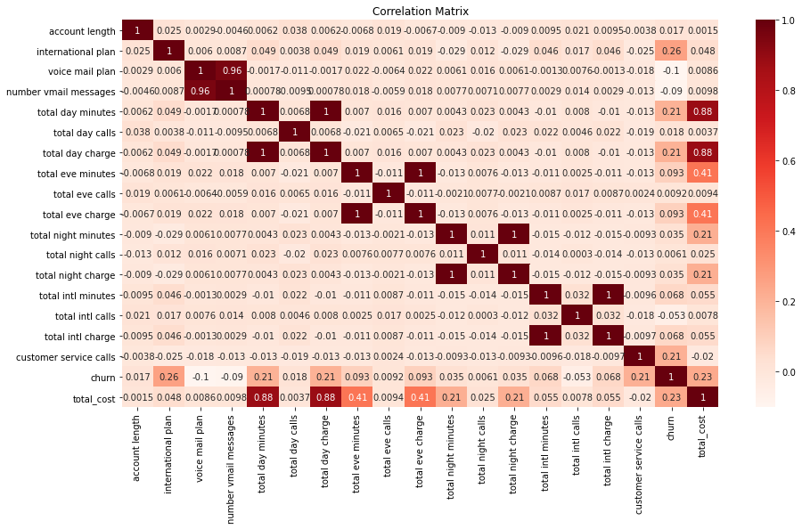

# SYRIATEL CUSTOMER CHURN PREDICTION 

# Business Understanding
Keeping customers happy is really important for businesses, especially in the competitive telecommunications industry. In any business it is cheaper and easier to maintain the customer base than to add new customers. In line with customer retention we are developing a predictive model for SyriaTel that can predict which customers might leave. We're going to look at different kinds of information about the customers, like their location, how they use the service, if they have made any complaints, and their billing history. By doing this, we hope to find patterns and reasons why customers might leave. We'll use this information to build a model that can tell us who is likely to leave. We'll carefully check how well the model works before using it. This way, SyriaTel can keep an eye on customers who might leave and work on retaining them. This helps the company avoid losing money from customers leaving.

#### Objectives
The business objectives of this project for SyriaTel are; 
* To comprehend the elements influencing customer churn.
* To foster customer loyalty.
* To improve overall customer retention.

## The Data
The data used for the project can be found here(https://www.kaggle.com/datasets/becksddf/churn-in-telecoms-dataset).

During the data cleaning, and exploratory data analysis:
* We found that the data had 3333 rows and 21 columns. The coulmns are: 'state', 'account length', 'area code', 'phone number',
       'international plan', 'voice mail plan', 'number vmail messages',
       'total day minutes', 'total day calls', 'total day charge',
       'total eve minutes', 'total eve calls', 'total eve charge',
       'total night minutes', 'total night calls', 'total night charge',
       'total intl minutes', 'total intl calls', 'total intl charge',
       'customer service calls', 'churn'
* The data did not contain any missing data and/or duplicates.
* Because the model was to deal with data that is binary or scaled data, there was no need to check for outliers.

## Data Preprocessing and Modelling

During EDA, discovered that there was perfect correlation between the following variables:
        * Total day minutes and total day charge
        * Total eve minutes and total eve charge
        * Total night minutes and total night charge
        * Total intl minutes and total intl charge
Chose to drop the following columns to deal with multicolleniarity: Total day minutes, Total eve minutes, Total night minutes and Total intl minutes.

Scaled the data to deal with outliers, used train_test_split method to divide our data into the training and testing data we need to perform our modeling. Used the SMOTE technique to deal with data imbalance.

used 3 different models to check which performed better. The models were:

* Logistic Regression.
* Decision trees
* Random Forest

## Conclusion
The random forest emerged as the top-performing model for two key reasons. Firstly, it demonstrated a notable recall score of 0.77, indicating a 77% accuracy in identifying customers at risk of churn. This aligns perfectly with our goal of effectively recognizing and addressing churn.

The random forest model exhibited a commendable accuracy score of 0.94, signifying a 94% success rate in correctly classifying churn cases. This high accuracy underscores the model's effectiveness in predicting churn accurately, a critical factor for informed business decision-making.

The model's impressive ability to harmonize precision and recall is evident in its F1 score of 0.81. Combining these metrics into a single measure, the F1 score reflects a balanced evaluation of the model's performance. With a higher F1 score, the random forest model efficiently identifies true positives while minimizing both false positives and false negatives. In our context, the F1 score of 0.81 underscores the model's adeptness at striking a precise balance between precision and recall, ensuring accurate identification of churn cases.

## Recommendations
SyriaTel can improve customer retention by: 
* Using the Random Forest Classifier for predicting churn in real-time. Regularly monitoring the model ensures it stays effective, with updates adjusting to changing customer behaviors
* Analyzing feature importance helps identify areas for targeted service improvements and personalized retention efforts. What is obderved is that call cost, duration of calls and charges related to voice mail services have a huge impact on the churn rate. having better incentives for categories of customers who use this services are more likely to reduce churn.
* Work closely with retention teams ensures smooth integration and informed decision-making. 
* By combining quantitative predictions with qualitative customer feedback, SyriaTel gains a thorough understanding for crafting nuanced retention strategies.
* Continuous model enhancements and investments in customer experience initiatives contribute to long-term success, optimizing resource allocation and nurturing lasting relationships in the telecommunications industry.